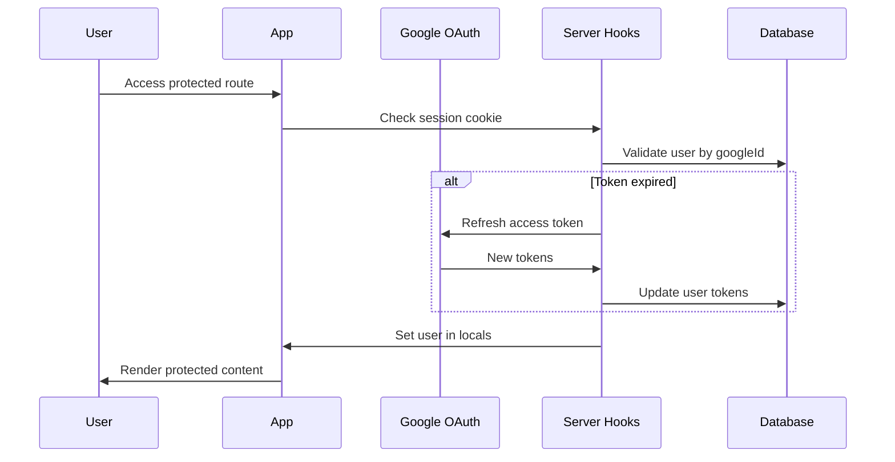

# Ayvu - Research Paper Management Platform

A comprehensive SvelteKit application for reading, managing, and analyzing research papers from arXiv with advanced AI-powered features including Retrieval-Augmented Generation (RAG), Google Drive integration, and intelligent chat capabilities.

## 🚀 Features

### Core Functionality
- **Google OAuth Authentication**: Secure sign-in with Google accounts and automatic token refresh
- **arXiv Integration**: Direct import of research papers via arXiv URLs with metadata extraction
- **Google Drive Storage**: Automatic organization and storage of papers in structured Drive folders
- **AI-Powered Chat**: Intelligent paper analysis using Google Gemini with RAG-enhanced context
- **Vector Database**: Local IndexedDB-based vector storage for semantic search and retrieval
- **Real-time Processing**: Server-sent events for live progress tracking during paper processing
- **Responsive Design**: Mobile-first UI with adaptive layouts and dark/light theme support

### Advanced Features
- **Retrieval-Augmented Generation (RAG)**: Contextual AI responses based on paper content
- **Web Workers**: Background embedding generation using Hugging Face Transformers
- **Vector Search**: Semantic similarity search through locally stored embeddings
- **Table of Contents**: Automatic extraction and navigation of paper sections
- **Progressive Enhancement**: Offline-capable with intelligent caching strategies

## 🏗️ Architecture Overview

### Tech Stack
- **Frontend**: SvelteKit 2.0 with TypeScript and Svelte 5 (runes)
- **Database**: Turso (LibSQL) with Drizzle ORM for type-safe database operations
- **Authentication**: Google OAuth 2.0 with secure session management
- **Storage**: Google Drive API for PDF storage and organization
- **AI/ML**: Google Gemini AI with Hugging Face Transformers for embeddings
- **Vector DB**: Custom IndexedDB wrapper with HNSW indexing via MeMemo
- **Styling**: SCSS with custom design system and responsive breakpoints
- **Testing**: Vitest with comprehensive unit and integration test coverage

### Key Architectural Patterns

#### 1. Layered Architecture
```
┌─────────────────────────────────────┐
│           Presentation Layer        │
│     (Svelte Components + Routes)    │
├─────────────────────────────────────┤
│           Business Logic            │
│      (Server Actions + Hooks)      │
├─────────────────────────────────────┤
│          Data Access Layer         │
│       (Drizzle ORM + Schemas)      │
├─────────────────────────────────────┤
│         External Services          │
│   (Google APIs + AI + Vector DB)   │
└─────────────────────────────────────┘
```

#### 2. Authentication Flow


## 📁 Detailed Project Structure

### Core Configuration
```
├── package.json                 # Dependencies and scripts
├── svelte.config.js            # SvelteKit configuration with aliases
├── vite.config.ts              # Vite bundler configuration
├── drizzle.config.ts           # Database migration configuration
├── tsconfig.json               # TypeScript compiler configuration
└── vitest.config.ts            # Test runner configuration
```

### Source Code Organization
```
src/
├── app.d.ts                    # Global type declarations
├── app.html                    # HTML template with theme injection
├── hooks.server.ts             # Server-side middleware and authentication
│
├── lib/                        # Shared library code
│   ├── components/             # Reusable Svelte components
│   │   ├── AIChat.svelte      # RAG-powered chat interface
│   │   ├── PaperCard.svelte   # Paper display component
│   │   ├── PaperForm.svelte   # Paper submission form
│   │   ├── Modal.svelte       # Reusable modal component
│   │   ├── Header.svelte      # Navigation header
│   │   ├── Sidebar.svelte     # Navigation sidebar
│   │   ├── TableOfContents.svelte # Paper navigation
│   │   ├── Toast.svelte       # Notification system
│   │   └── Spinner/           # Loading animations
│   │
│   ├── db/                     # Database layer
│   │   ├── index.ts           # Database connection setup
│   │   ├── User.db.ts         # User CRUD operations
│   │   ├── Paper.db.ts        # Paper CRUD operations
│   │   └── schema/            # Database schemas
│   │       ├── User.schema.ts # User table definition
│   │       └── Paper.schema.ts # Paper table definition
│   │
│   ├── RAG/                    # AI and vector database
│   │   ├── vdb.ts             # Vector database implementation
│   │   └── embedWorker.ts     # Web worker for embeddings
│   │
│   ├── stores/                 # Svelte stores
│   │   └── ToastStore.ts      # Global notification state
│   │
│   ├── types/                  # TypeScript definitions
│   │   ├── User.type.ts       # User interface
│   │   ├── RAG.type.ts        # RAG-related types
│   │   ├── SSE.type.ts        # Server-sent events types
│   │   └── Toc.type.ts        # Table of contents types
│   │
│   ├── utils/                  # Utility functions
│   │   ├── google-auth.ts     # Google authentication helpers
│   │   ├── google.ts          # Google API utilities
│   │   ├── drive-image.ts     # Drive image processing
│   │   ├── nanoid.ts          # ID generation
│   │   └── paperForm/         # Form handling utilities
│   │
│   └── directive/              # Svelte actions
│       └── clickOutside.ts    # Click outside detection
│
├── routes/                     # SvelteKit routing
│   ├── +layout.server.ts      # Root layout server logic
│   ├── +layout.svelte         # Root layout component
│   │
│   ├── (home)/                # Public routes
│   │   ├── +layout.svelte     # Home layout
│   │   └── +page.svelte       # Landing page
│   │
│   ├── (auth)/                # Authentication routes
│   │   └── auth/
│   │       ├── +page.server.ts # Auth actions (login/logout)
│   │       └── callback/
│   │           └── +server.ts  # OAuth callback handler
│   │
│   ├── (app)/                 # Protected application routes
│   │   └── app/
│   │       ├── +layout.server.ts # App layout server logic
│   │       ├── +layout.svelte    # App layout with sidebar
│   │       ├── +page.server.ts   # Papers list logic
│   │       ├── +page.svelte      # Papers dashboard
│   │       ├── explore/          # Paper discovery
│   │       ├── debug/            # Development tools
│   │       └── paper/
│   │           └── [id]/
│   │               ├── +page.server.ts # Paper detail logic
│   │               └── +page.svelte    # Paper reader view
│   │
│   └── (api)/                 # API endpoints
│       └── api/
│           ├── paper/
│           │   └── +server.ts  # Paper processing API
│           ├── chat/           # AI chat endpoints
│           ├── debug/          # Debug endpoints
│           └── drive-image/    # Image proxy endpoints
│
├── styles/                     # SCSS styling system
│   ├── root/                  # Global styles and utilities
│   │   ├── reset.scss         # CSS reset
│   │   ├── global.scss        # Global styles
│   │   └── _mixins.scss       # SCSS mixins and functions
│   ├── Crisp/                 # Design system components
│   │   ├── CrispButton.scss   # Button styles
│   │   ├── CrispInput.scss    # Input field styles
│   │   └── CrispLabel.scss    # Label styles
│   └── reader/                # Paper reader specific styles
│
└── test/                       # Test configuration
    └── setup.ts               # Test environment setup
```

## 🔧 Core System Components

### 1. Authentication System (`hooks.server.ts`)

The authentication system uses a multi-layered approach with server hooks for secure session management:

**Key Components:**
- **Session Management**: HTTP-only cookies with automatic cleanup
- **Token Refresh**: Proactive token renewal before expiration
- **Route Protection**: Middleware-based access control
- **Error Handling**: Graceful fallback for authentication failures

```typescript
// Authentication flow implementation
const authentication: Handle = async ({ event, resolve }) => {
    const googleSub = event.cookies.get('session');
    if (googleSub) {
        const user = await getUserById(googleSub);
        if (user && isTokenExpiring({ expiry_date: user.expiryDate })) {
            // Automatic token refresh logic
            const { credentials } = await client.refreshAccessToken();
            await updateUserTokens({ /* updated tokens */ });
        }
    }
    return resolve(event);
};
```

### 2. Database Architecture

**Schema Design:**
- **Users Table**: Stores OAuth tokens, profile data, and session information
- **Papers Table**: Contains arXiv metadata, abstracts, and user associations

**Key Features:**
- Type-safe operations with Drizzle ORM
- Automatic timestamp generation
- JSON field support for arrays (authors)
- Conflict resolution with upsert operations

### 3. Google Drive Integration (`lib/drive.ts`)

**Folder Structure:**
```
Google Drive
└── .ayvu/
    ├── paper-id-1/
    │   ├── paper-id-1.pdf
    │   ├── embeddings.json
    │   └── paper-id-1.html
    └── paper-id-2/
        ├── paper-id-2.pdf
        ├── embeddings.json
        └── paper-id-2.html
```

**Features:**
- Automated folder creation and organization
- File permission management (public access)
- Stream-based file uploads for memory efficiency
- Thumbnail generation and caching

### 4. AI-Powered RAG System

#### Vector Database (`lib/RAG/vdb.ts`)
Custom implementation using IndexedDB for persistent local storage:

```typescript
class VectorIDB {
    // HNSW index for efficient similarity search
    private index: HNSW;
    
    // IndexedDB for persistent storage
    private dbPromise: Promise<IDBDatabase>;
    
    async query(vector: number[], k: number) {
        // Semantic similarity search
        const { keys, distances } = await this.index.query(vector, k);
        // Retrieve associated metadata
        return { keys, distances, metadata };
    }
}
```

#### Embedding Worker (`lib/RAG/embedWorker.ts`)
Web Worker implementation for background processing:

```typescript
// Non-blocking embedding generation
class Embeddings {
    private model: PreTrainedModel;
    private tokenizer: PreTrainedTokenizer;
    
    async queryEmbedding(query: string) {
        const input = `${PREFIXES.query}${query}`;
        const tokenized = await this.tokenizer([input]);
        const { sentence_embedding } = await this.model(tokenized);
        return sentence_embedding.tolist()[0];
    }
}
```

#### Chat Interface (`components/AIChat.svelte`)
Interactive chat with contextual responses:

1. **Query Processing**: User input is processed and rewritten for optimal retrieval
2. **Vector Search**: Semantic search finds relevant paper sections
3. **Context Injection**: Retrieved content is injected into the AI prompt
4. **Response Generation**: Google Gemini generates contextual responses

### 5. Real-time Processing System

**Server-Sent Events (SSE)** for live progress tracking:

```typescript
// Streaming response for paper processing
export const POST: RequestHandler = async ({ request, locals }) => {
    const progressStream = new ReadableStream({
        async start(controller) {
            // Process paper and stream progress updates
            const reader = response.body!.getReader();
            while (true) {
                const { done, value } = await reader.read();
                if (done) break;
                
                // Parse and forward progress data
                controller.enqueue(progressData);
            }
        }
    });
    
    return new Response(progressStream, {
        headers: { 'Content-Type': 'text/event-stream' }
    });
};
```

## 🔄 Data Flow Architecture

### Paper Processing Pipeline
1. **Input Validation**: arXiv URL format validation and duplicate checking
2. **Metadata Extraction**: XML parsing of arXiv API responses
3. **External Processing**: SSE-based communication with Python processing service
4. **Progress Tracking**: Real-time updates via Server-Sent Events
5. **Storage**: Database insertion and Drive file organization
6. **Embedding Generation**: Background vector computation for RAG

### Chat Interaction Flow
1. **Query Input**: User submits question about paper
2. **Query Rewriting**: AI optimization for better retrieval
3. **Embedding Generation**: Web Worker computes query vector
4. **Similarity Search**: Vector database returns relevant sections
5. **Context Assembly**: Retrieved content formatted for AI prompt
6. **Response Generation**: Google Gemini processes contextualized query
7. **Stream Response**: Real-time response rendering

## 🎨 Design System

### Component Architecture
- **Crisp Design System**: Consistent styling across all components
- **Responsive Breakpoints**: Mobile-first approach with progressive enhancement
- **SCSS Architecture**: Modular styling with mixins and utility functions
- **Theme Support**: Dynamic theme switching with CSS custom properties

### Key Components

#### `PaperCard.svelte`
Flexible paper display component with three layout modes:
- **Desc**: Full preview with image and abstract
- **No-Preview**: Text-only layout for compact display
- **Table**: Minimal row layout for lists

#### `AIChat.svelte`
Advanced chat interface featuring:
- **Message History**: Persistent conversation state
- **Context Display**: Visual indication of retrieved content
- **Progress Tracking**: Real-time processing status
- **Keyboard Shortcuts**: Enhanced UX with Enter to send

#### `Modal.svelte`
Reusable modal system with:
- **Backdrop Blur**: Modern visual effects
- **Keyboard Navigation**: Accessibility-focused interactions
- **Animation System**: Smooth transitions and entrance effects

## 📈 Performance Optimizations

### Client-Side
- **Code Splitting**: Automatic route-based splitting
- **Web Workers**: Background processing for embeddings
- **IndexedDB**: Persistent local storage for vectors
- **Progressive Loading**: Lazy loading of heavy components

### Server-Side
- **Connection Pooling**: Efficient database connections
- **Token Caching**: Reduced API calls through intelligent caching
- **Stream Processing**: Memory-efficient file handling
- **Error Boundaries**: Graceful degradation for failed operations

## 🧪 Testing Strategy

### Test Coverage (41/44 tests passing)
- **Authentication Flows**: Login, logout, token refresh scenarios
- **Database Operations**: CRUD operations with error handling
- **Google Drive Integration**: File upload, organization, permissions
- **PDF Processing**: Validation, metadata extraction, storage
- **Error Handling**: Comprehensive error scenario coverage

### Test Categories
```bash
npm test                    # Run all tests
npm run test:run           # CI mode
npm run test:coverage      # Coverage report
```

## 🚀 Important Commits

The following commits represent major milestones in the project development:

### Core Architecture & Infrastructure
- **[956078e]** `chore: hide all console logs` - Production cleanup
- **[715965f]** `feat: drag resize of panels` - Enhanced UX with resizable layout
- **[1a18b52]** `feat: fully functional server sent events` - Real-time processing

### AI & RAG Implementation  
- **[776b935]** `feat: fully functioning RAG` - Complete RAG system integration
- **[6a52fd6]** `feat: functioning RAG` - Initial RAG implementation
- **[a47fea0]** `feat: on demand embedding file fetch and indexdb vector store` - Vector storage system
- **[a50e8da]** `feat: functional gemini button` - AI chat integration

### UI & Component Development
- **[3b35697]** `feat: functional sidebar` - Navigation system
- **[f11f21d]** `chore: new layout for paper page` - Improved paper reading experience
- **[b2857fc]** `feat: refactored form error handling` - Enhanced form UX

### Testing & Quality Assurance
- **[13af8d0]** `feat: add comprehensive tests for Paper and User database operations` - Database testing
- **[36c1521]** `Implement code changes to enhance functionality and improve performance` - Performance optimizations

## 🛠️ Development Workflow

### Prerequisites
- Node.js 18+
- npm or pnpm
- Google OAuth credentials
- Turso database instance

### Installation & Setup
```bash
# Clone and install dependencies
git clone <repository-url>
cd ayvu
npm install

# Environment setup
cp .env.example .env
# Configure your credentials:
# - GOOGLE_CLIENT_ID, GOOGLE_CLIENT_SECRET, GOOGLE_REDIRECT_URI
# - TURSO_DATABASE_URL, TURSO_AUTH_TOKEN
```

### Development Commands
```bash
npm run dev              # Development server with hot reload
npm run build           # Production build
npm run preview         # Preview production build
npm run db-push         # Run database migrations
npm run db:studio       # Open database management UI
npm run lint            # Code linting
npm run format          # Code formatting
```

### Environment Variables
```env
# Google OAuth Configuration
GOOGLE_CLIENT_ID=your_google_client_id
GOOGLE_CLIENT_SECRET=your_google_client_secret  
GOOGLE_REDIRECT_URI=http://localhost:5173/auth/callback

# Database Configuration
TURSO_DATABASE_URL=your_turso_database_url
TURSO_AUTH_TOKEN=your_turso_auth_token

# Optional: AI Service Configuration
GEMINI_API_KEY=your_gemini_api_key
```

## 🔮 Future Enhancements

### Planned Features
- **Collaborative Annotations**: Shared paper annotations and discussions
- **Advanced Search**: Full-text search across paper collections
- **Citation Management**: Automatic bibliography generation
- **Paper Recommendations**: AI-powered discovery of related papers
- **Offline Reading**: Enhanced PWA capabilities for offline access
- **Export Capabilities**: PDF annotations and note exports

### Technical Improvements
- **Performance**: Vector search optimization and caching strategies
- **Scalability**: Microservice architecture for processing pipeline
- **Security**: Enhanced authentication with MFA support
- **Accessibility**: WCAG 2.1 AA compliance improvements
- **Internationalization**: Multi-language support

## 🤝 Contributing

### Development Process
1. Fork the repository
2. Create a feature branch (`git checkout -b feature/amazing-feature`)
3. Make your changes with appropriate tests
4. Ensure all tests pass (`npm test`)
5. Follow the established code style (`npm run lint`)
6. Submit a pull request with detailed description

### Code Standards
- **TypeScript**: Strict mode with comprehensive type definitions
- **Testing**: Minimum 80% coverage for new features
- **Documentation**: JSDoc comments for all public APIs
- **Styling**: Follow the Crisp design system patterns
- **Accessibility**: ARIA labels and keyboard navigation support

## 📜 License

This project is part of a capstone project for academic purposes. All rights reserved.

---

## 📚 Additional Resources

### Related Documentation
- [SvelteKit Documentation](https://kit.svelte.dev/)
- [Drizzle ORM Guide](https://orm.drizzle.team/)
- [Google Drive API Reference](https://developers.google.com/drive/api)
- [Hugging Face Transformers.js](https://huggingface.co/docs/transformers.js)

### External Tools Used
```bash
# LaTeX to HTML conversion pipeline
pandoc paper.html -f raw_html -t gfm -o ../markdown/paper.md --extract-media=../markdown/media --strip-comments --resource-path=.

latexmlc --format=html5 --destination=./paper.html ../2/main.tex

latexmlc --split --splitat=section --timestamp=0 --navigationtoc=context --nocomments --javascript="https://cdn.jsdelivr.net/npm/mathjax@3/es5/tex-mml-chtml.js?config=MML_HTMLorMML" --destination=./paper.html ../1/conference_101719.tex
```

### Known Issues
- Table captions appear on the same line (LaTeX conversion limitation)
- Embedding model initialization requires significant initial download
- SSE connections may timeout on slower networks

---

*Built with ❤️ using SvelteKit, TypeScript, and modern web technologies.*
